## 암호모듈 구현안내서GVeuniddeo rf oImr

Part 2

검증대상 암호알고리즘 구현안내서


## Vendor Implementations

GVI Part 2

Guide for Vendor Implementations

## Contents

| 1장   | 개요                          |   2 |
|-------|-------------------------------|-----|
| 2장   | 블록암호 운영모드(일반)       |  12 |
| 3장   | 블록암호 운영모드(인증암호화) |  28 |
| 4장   | 블록암호 기반 메시지인증코드  |  42 |
| 5장   | 해시함수 기반 메시지인증코드  |  54 |
| 6장   | 블록암호 기반 난수발생기      |  60 |
| 7장   | 해시함수 기반 난수발생기      |  80 |
| 8장   | RSA 기반 공개키 암호          | 100 |
| 9장   | RSA 기반 전자서명             | 112 |
| 10장  | 이산대수 기반 전자서명        | 124 |
| 11장  | 타원곡선 기반 전자서명        | 136 |
| 12장  | 이산대수 기반 키 설정         | 152 |
| 13장  | 타원곡선 기반 키 설정         | 160 |
| 14장  | 패스워드 기반 키 유도         | 168 |
| 15장  | 의사난수 함수 기반 키 유도    | 174 |
| 부록  |                               | 186 |


## 개 요


## 목적

- 암호모듈 검증제도는 국가·공공기관에서 소통‧ ‧ ‧저장되는 비밀이 아닌 업무자료를 보호하기 위해 사용되는 암호모듈의 안전성과 구현 적합성을 검증하는 제도이다.
- 안내서에서는 ｢ 암호알고리즘 검증기준 ｣ 에 수록된 검증대상 암호알고리즘의 요구사항에 대하여 구현 안전성 관점에서 고려사항을 명세한다.
- 안내서는 암호모듈 검증제도의 검증대상 암호알고리즘별로 안전성에 영향을 미치는 항목을 제공함으로써, 암호모듈에 대한 잠재적인 취약점에 대응할 수 있도록 한다.


## 범위

- 안내서에서 다루는 알고리즘별 검토항목은 암호모듈 검증기준과 시험기준에서 요구하는 보안요구사항(키 관리, 파라미터 형식검증, 예외 처리 등)을 검증대상 암호알고리즘에 적용하여 도출하였다.
- 안내서 내용은 표준 일치성 여부 확인과 암호알고리즘에 대한 보안요구사항 준수여부 확인으로 구성된다.
- 안내서의 알고리즘별 약어 및 기호는 참조표준을 준수하였으며, 알고리즘 참조구현값은 해당 표준을 참고해야 한다.


## 활용대상 및 방법

- 안내서는 암호모듈 개발자와 암호모듈 시험자가 활용할 수 있다.
- 암호모듈 개발자는 암호모듈 개발 시, 안내서를 참고하여 암호알고리즘 구현 안전성 요소를 파악하여 적합하게 적용할 수 있다.
- 암호모듈 시험자는 암호모듈에 포함된 검증대상 암호알고리즘에 대한 구현 안전성 요소를 확인할 수 있다.


## 법적 근거

- 「사이버안보 업무규정」 제9조(사이버보안 예방 조치 등)
- 「전자정부법 시행령」 제69조(전자문서의 보관 ･ 유통 관련 보안조치)
- 「암호모듈 시험 및 검증지침」 (국가정보원, 2025)


## 검증대상 암호알고리즘 목록 5

## q 다 다음은 검증기관이 선정한 검증대상 암호알고리즘 목록이다.

| 구 분    |       | 암호알고리즘                                                     | 참조표준   | 참조표준                                                                                                                                                                                                                                 |
|----------|-------|------------------------------------------------------------------|------------|------------------------------------------------------------------------------------------------------------------------------------------------------------------------------------------------------------------------------------------|
|          | ARIA  | 운영모드 ·기밀성(ECB, CBC, OFB, CFB, CTR) ·기밀성/인증(GCM, CCM) | 국내       | [KS X 1213-1] 128비트 블록 암호 알고리즘 ARIA ­ 제1부: 일반 (2024) [KS X 1213-2] 128비트 블록 암호 알고리즘 ARIA ­ 제2부: 운영모드(2024) [KS X ISO/IEC 10116] n비트 블록 암호 운영 모드 (2021) [KS X ISO/IEC 19772] 인증된 암호화 (2024) |
|          | ARIA  | 운영모드 ·기밀성(ECB, CBC, OFB, CFB, CTR) ·기밀성/인증(GCM, CCM) | 국외       | [IETF RFC 5794] A Description of the ARIA Encryption Algorithm (2010) [ISO/IEC 10116] Modes of operation for an n-bit block cipher (2017) [ISO/IEC 19772] Authenticated Encryption (2020)                                                |
|          | SEED  | 운영모드 ·기밀성(ECB, CBC, OFB, CFB, CTR) ·기밀성/인증(GCM, CCM) | 국내       | [KS X ISO/IEC 18033-3] 암호 알고리즘 ­ 제3부: 블록 암호 (2023) [TTAS.KO-12.0004/R1] 128비트 블록암호알고리즘 SEED (2005) [KS X ISO/IEC 10116] n비트 블록 암호 운영 모드 (2021) [KS X ISO/IEC 19772] 인증된 암호화 (2024)                 |
|          | SEED  | 운영모드 ·기밀성(ECB, CBC, OFB, CFB, CTR) ·기밀성/인증(GCM, CCM) | 국외       | [ISO/IEC 18033-3] Encryption algorithms Part 3: Block ciphers (2010) [ISO/IEC 10116] Modes of operation for an n-bit block cipher (2017) [ISO/IEC 19772] Authenticated Encryption (2020)                                                 |
| 블록암호 | LEA   | 운영모드 ·기밀성(ECB, CBC, OFB, CFB, CTR) ·기밀성/인증(GCM, CCM) | 국내       | [KS X ISO/IEC 29192-2] 경량 암호 ­ 제2부: 블록 암호 (2024) [KS X ISO/IEC 10116] n비트 블록 암호 운영 모드 (2021) [KS X ISO/IEC 19772] 인증된 암호화 (2024)                                                                               |
| 블록암호 | LEA   | 운영모드 ·기밀성(ECB, CBC, OFB, CFB, CTR) ·기밀성/인증(GCM, CCM) | 국외       | [ISO/IEC 29192-2] Lightweight cryptography Part 2: Block ciphers (2019) [ISO/IEC 10116] Modes of operation for an n-bit block cipher (2017) [ISO/IEC 19772] Authenticated Encryption (2020)                                              |
| 블록암호 | HIGHT | 운영모드 ·기밀성(ECB, CBC, OFB, CFB, CTR)                        | 국내       | [KS X ISO/IEC 18033-3] 암호 알고리즘 ­ 제3부: 블록 암호 (2023) [TTAS.KO-12.0040/R1] 64비트 블록암호 HIGHT (2008) [KS X ISO/IEC 10116] n비트 블록 암호 운영모드 (2021)                                                                    |
| 블록암호 | HIGHT | 운영모드 ·기밀성(ECB, CBC, OFB, CFB, CTR)                        | 국외       | [ISO/IEC 18033-3] Encryption algorithms Part 3: Block ciphers (2010) [ISO/IEC 10116] Modes of operation for an n-bit block cipher (2017)                                                                                                 |
| 블록암호 | AES   | 운영모드 ·기밀성(ECB, CBC, OFB, CFB, CTR) ·기밀성/인증(GCM, CCM) | 국내       | [KS X ISO/IEC 18033-3] 암호 알고리즘 ­ 제3부: 블록 암호 (2023) [KS X ISO/IEC 10116] n비트 블록 암호 운영 모드 (2021) [KS X ISO/IEC 19772] 인증된 암호화 (2024)                                                                           |
| 블록암호 | AES   | 운영모드 ·기밀성(ECB, CBC, OFB, CFB, CTR) ·기밀성/인증(GCM, CCM) | 국외       | [ISO/IEC 18033-3] Encryption algorithms Part 3: Block ciphers (2010) [ISO/IEC 10116] Modes of operation for an n-bit block cipher (2017) [ISO/IEC 19772] Authenticated Encryption (2020)                                                 |
| 블록암호 | SHA-2 | SHA2-224/256/384/512                                             | 국내       | [KS X ISO/IEC 10118-3] 해시함수 ­ 제3부: 전용 해시 함수 (2023)                                                                                                                                                                           |
| 블록암호 | SHA-2 | SHA2-224/256/384/512                                             | 국외       | [ISO/IEC 10118-3] Hash-functions Part 3: Dedicated hash-functions (2018)                                                                                                                                                                 |
| 해시함수 | LSH   | LSH-224/256/384/512/ 512-224/512-256                             | 국내       | [KS X 3262] 해시 함수 LSH (2023)                                                                                                                                                                                                         |
| 해시함수 | SHA-3 | SHA3-224/256/384/512                                             | 국내       | -                                                                                                                                                                                                                                        |


## 문서의 구성

- 안내서는 총 15장으로 구성되며, 1장에서는 안내서의 목적, 법적근거, 그리고 안내서의 대상이 되는 검증대상 알고리즘을 다룬다.
- 2장에서 15장까지는 검증대상 알고리즘에 포함된 각 알고리즘에 대하여, 간략한 소개와 함께 구현 시 고려사항을 기술한다.
- 고려사항은 암호모듈에 입력되는 데이터 처리 메커니즘을 주로 확인하는 입력조건에 대한 항목과 내부 데이터 생성, 제로화, 예외 사항처리 등을 포함한 내부조건에 대한 항목으로 나누어서 기술한다.
- 2장 블록암호 운영모드는 ARIA, SEED, LEA, HIGHT, AES 블록암호 운영모드 ECB, CBC, CTR, CFB, OFB에 대한 구현 시 고려사항을 다룬다.
- 3장 블록암호 운영모드(인증암호화)는 인증암호화 운영모드 GCM, CCM에 대한 구현 시 고려사항을 다룬다.
- 4장 블록암호 기반 메시지인증코드는 블록암호를 내부적으로 이용하는 CMAC, GMAC 알고리즘의 구현 시 고려사항을 다룬다.
- 5장 해시함수 기반 메시지인증코드는 HMAC에 대한 구현 시 고려사항을 다룬다.
- 6장 블록암호 기반 난수발생기는 내부적으로 블록암호(ARIA, SEED, LEA, AES, HIGHT)를 사용하는 난수발생기 (CTR\_DRBG)의 구현 시 고려사항을 다룬다.
- 7장 해시함수 기반 난수발생기는 해시함수를 사용하는 난수발생기(Hash\_DRBG), HMAC을 사용하는 난수발생기 (HMAC\_DRBG)의 구현 시 고려사항을 다룬다.
- 8장 공개키 암호는 IF(Integer Factorization)에 기반을 둔 RSAES 공개키 암호의 구현 시 고려사항을 다룬다.
- 9장 RSA 기반 전자서명은 IF(Integer Factorization)에 기반을 둔 RSA-PSS 전자서명의 구현 시 고려사항을 다룬다.
- 10장 이산대수 기반 전자서명은 DLP(Discrete Logarithm Progblem)에 기반을 둔 KCDSA 전자서명의 구현 시 고려사항을 다룬다.
- 11장 타원곡선 기반 전자서명은 EC(Elliptic Curve)-DLP에 기반을 둔 ECDSA, EC-KCDSA 전자서명의 구현 시 고려사항을 다룬다.
- 12장 이산대수 기반 키 설정은 DLP(Discrete Logarithm Problem)에 기반을 둔 DH 키 설정 알고리즘의 구현 시 고려사항을 다룬다.
- 13장 타원곡선 기반 키 설정은 EC(Elliptic Curve)-DLP에 기반을 둔 ECDH 키 설정 알고리즘의 구현 시 고려사항을 다룬다.
- 14장 패스워드 기반 키 유도는 HMAC PRF를 사용하는 PBKDF의 구현 시 고려사항을 다룬다.
- 15장 의사난수 함수 기반 키 유도는 HMAC, CMAC PRF를 CTR, FB, DP 모드로 운용하는 KBKDF의 구현 시 고려사항을 다룬다.


## 용어 정의 및 약어 8

#### 가. 용어 정의

| 정 의             | 의 미                                                                                                                                 |
|-------------------|---------------------------------------------------------------------------------------------------------------------------------------|
| 난수              | 생성되기 전에 예측할 수 없는 값으로, 암호시스템에서 난수는 암호 키, 논스, 솔트 등의 목적으로 사용됨                                   |
| 논스              | 특정 조건하에서 한번만 사용되는 값                                                                                                    |
| 평문              | 암호화 대상이 되는 문자열 및 암호문을 복호화한 본래의 문자열                                                                          |
| 암호문            | 평문으로 된 정보를 암호 처리하여 특정인만 이용할 수 있도록 암호화한 문자열                                                            |
| 암호화            | 암호화 키를 사용하여 평문을 암호문으로 변환하는 것                                                                                    |
| 보안 강도         | 해당 암호알고리즘 또는 암호시스템이 공격자로부터 데이터를 보호할 수 있는 계량화된 수준                                                |
| 복호화            | 복호화 키를 사용하여 암호문을 본래의 평문으로 복원하는 것                                                                             |
| 부가인증 데이터   | 메시지 인증 함수의 입력 데이터로서 인증되지만 암호화되지 않은 데이터 (메시지 인증코드 부분으로 이동)                                  |
| 블록              | 운영모드의 처리 단위                                                                                                                  |
| 블록암호 운영모드 | 블록 암호를 이용하여 임의의 크기를 갖는 데이터를 암/복호화하기 위해 적용하는 방식                                                     |
| 비밀키            | 대칭키 암호알고리즘과 함께 사용되며, 하나 또는 여러 객체에서 유일하게 결합되는 암호키이므로, 공개되어서는 안 됨                       |
| 씨드              | 암호함수 또는 난수생성의 초기화를 위해 사용되는 비밀 값                                                                               |
| 인증 값           | 우연히 발생한 에러와 데이터의 의도적인 조작을 모두 발견할 수 있도록 설계된 데이터로 해당 비밀키를 소유한 경우에만 확인할 수 있음      |
| 엔트로피          | 데이터가 가지는 정보량을 수치적으로 나타낸 것으로, 난수성에 대한 정량화된 지표                                                        |
| 키 유도           | 하나의 암호 키로부터 대칭키 암호알고리즘의 암호 키들로 사용할 수 있는 키 요소를 얻는 과정                                             |
| 패딩              | 평문에 특정한 데이터를 채워서 운영모드 블록 크기의 배수로 만드는 기법                                                                 |
| 핵심보안매개변수  | 노출 또는 변경 시, 암호알고리즘 또는 암호모듈의 안전성을 크게 저하시키는 정보 (예: 암호키, 개인키, 패스워드, 난수발생기 내부 상태 등) |


## 2장 블록암호 운영모드 (일반)

## 블록암호 운영모드(일반)


## 범위

- q 본 본 문서에서는 블록암호 운영모드 중 암 ･ 복호화 전용 운영모드를 구현하기 위한 고려사항을 기술한다.

암 ･ 복호화 전용 운영모드

ECB, CBC, CFB, OFB, CTR


## 관련표준

- [KS X ISO/IEC 10116] n비트 블록 암호 운영모드 (2021)
- [ISO/IEC 10116] Modes of operation for an n-bit block cipher (2017)


## 기호

| 기 호        | 의 미                                                                                                                                                           |
|--------------|-----------------------------------------------------------------------------------------------------------------------------------------------------------------|
| $Len( X)$    | 비트열 $X$ 의 비트 길이                                                                                                                                         |
| $blocklen$   | 블록암호 알고리즘이 한 번의 연산으로 처리할 수 있는 1블록의 길이 (비트)                                                                                         |
| $PT[i]$      | $i$ 번째 평문 블록 ( $Len( PT[i]) == blocklen$ )                                                                                                                |
| $CT[i]$      | $i$ 번째 암호문 블록 ( $Len( CT[i]) == blocklen$ )                                                                                                              |
| $Key$        | 암‧ ‧ ‧복호화 시 사용하는 키                                                                                                                                    |
| $ENC$        | 암호화 알고리즘                                                                                                                                                 |
| $DEC$        | 복호화 알고리즘                                                                                                                                                 |
| $IV$         | $CBC, CFB, OFB$ 운영모드에서 사용되는 초기값                                                                                                                    |
| $s$          | $CFB$ 운영모드에서 사용되는 피드백 길이                                                                                                                         |
| $CTR$        | $CTR$ 운영모드에서 사용되는 초기값                                                                                                                              |
| $inc n ( X)$ | 비트열 $X$ 의 하위 $n$ 비트를 1만큼 증가시키는 함수 (상위 $Len( X)-n$ 비트는 고정) ※ $inc n ( X)= MSBLen(X)-n ( X)\parallel\parallel (( LSBn ( X)+1) mod 2 n )$ |
| $MSBi (x)$   | 주어진 비트열 $x$ 의 상위(왼쪽) $i$ 개 비트열                                                                                                                   |
| $LSBi (x)$   | 주어진 비트열 $x$ 의 하위(오른쪽) $i$ 개 비트열                                                                                                                 |


## 블록암호 운영모드

- 블록암호는 블록 단위로 암 ･ 복호화를 수행하는 알고리즘이다. 그러나 일반적으로 암호화 하고자 하는 평문의 길이는 한 블록 이상이며 매우 다양한 길이로 구성된다. 이처럼 임의의 길이를 갖는 데이터를 암 ･ 복호화하기 위해 입 ･ 출력 크기가 고정된 블록암호 알고리즘을 적용하는 방식을 블록암호 알고리즘의 운영모드라고 한다.
- 블록암호의 안전성에 영향을 끼치는 요소로는 비밀키의 길이, IV의 길이, 패딩 기법 등이 있다.

## 운영모드 명세 및 구현 시 고려사항 5

#### 가. ECB (Electronic CodeBook)

|          | ECB 운영모드                                                                                                                                                      |
|----------|-------------------------------------------------------------------------------------------------------------------------------------------------------------------|
| 특징     | － 동일한 평문에 대하여 동일한 암호문을 생성함 － 암호화/복호화 모두 병렬처리 가능 － 특정 암호문 블록만 복호화 가능 － 메시지 길이가 1블록 이하인 경우 패딩 필요 |
| 권고사항 | － 블록암호 알고리즘이 처리할 수 있는 1블록 길이를 초과하는 평문 입력 금지                                                                                        |

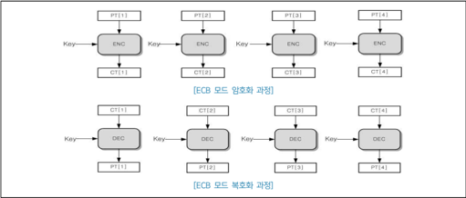

| ECB 모드 암호화(ECB_Enc )   | ECB 모드 암호화(ECB_Enc )                                                                                | 고려사항         |
|-----------------------------|----------------------------------------------------------------------------------------------------------|------------------|
| 입력                        | － 평문 $PT = PT[1]\parallel\parallel PT[2]\parallel\parallel ⋯\parallel\parallel PT[m]$ － 비밀키 $Key$ | ①, , ②, , ③, , ④ |
| 출력                        | － 암호문 $CT = CT[1]\parallel\parallel CT[2]\parallel\parallel ⋯\parallel\parallel CT[m]$               |                  |
| 1                           | for $i$ from $1$ to $m$ do                                                                               |                  |
| 2                           | $X = PT[i]$                                                                                              |                  |
| 3                           | $Y = ENC( X, Key)$                                                                                       |                  |
| 4                           | $CT[i] = Y$                                                                                              |                  |
| 5                           | end for                                                                                                  |                  |

| ECB 모드 복호화(ECB_Dec )   | ECB 모드 복호화(ECB_Dec )                                                                                | 고려사항    |
|-----------------------------|----------------------------------------------------------------------------------------------------------|-------------|
| 입력                        | - 암호문 $CT = CT[1]\parallel\parallel CT[2]\parallel\parallel ⋯\parallel\parallel CT[m]$ - 비밀키 $Key$ | ①, , ③, , ④ |
| 출력                        | - 평문 $PT = PT[1]\parallel\parallel PT[2]\parallel\parallel ⋯\parallel\parallel PT[m]$                  |             |
| 1                           | for $i$ from $1$ to $m$ do                                                                               |             |
| 2                           | $X = CT[i]$                                                                                              |             |
| 3                           | $Y = DEC( X, Key)$                                                                                       |             |
| 4                           | $PT[i] = Y$                                                                                              |             |
| 5                           | end for                                                                                                  |             |

#### ① 비밀키 길이 확인

## 블록암호별 지원 가능한 키 길이 확인

- -

- ARIA, LEA, AES의 비밀키 길이: 128/192/256 비트

- -

- SEED, HIGHT의 비밀키 길이: 128 비트

#### ② 안전한 비밀키 생성

블록암호 비밀키는 '중요보안매개변수(SSP) 생성' 방법으로 생성되어야 함

(검증대상 난수발생기를 이용하여 생성하는 등 안전한 방법으로 생성)

#### ③ 평문/암호문 길이 확인

블록암호별 처리 가능한 평문/암호문 길이 확인

- ARIA, SEED, LEA, AES의 평문 길이: 128 비트

- HIGHT의 평문 길이: 64 비트

- ※ 암호문의 경우 적용된 패딩 알고리즘을 고려하여 처리 가능한 길이를 확인해야 함

#### ④ 패딩 알고리즘

블록암호의 평문은 기본 블록길이의 배수가 되어야 하며, 그렇지 않을 경우 입력되는 평문의 길이가 기본 블록길이의 배수가 되도록 권고된 패딩방법 적용

패딩이 적용된 평문으로부터 생성된 암호문을 복호화할 경우에는, 복호화한 결과에서 패딩방법의 유효성을 검증한 후 패딩값을 제외해야 함

※ [부록] '안전한 패딩 방법' 참고

## [공통] 제로화 수행

사용이 끝난 중요보안매개변수(SSP)에 대한 제로화 수행

※ [부록] '안전한 제로화' 참고

#### 나. CBC (Cipher Block Chaining)

|          | CBC 운영모드                                                                                                                                                                                                                                                                                                                                    |
|----------|-------------------------------------------------------------------------------------------------------------------------------------------------------------------------------------------------------------------------------------------------------------------------------------------------------------------------------------------------|
| 특징     | － 이전 평문 블록에 대한 암호문 블록이 다음 평문 블록과 XOR된 후 암호화됨 (첫 번째 평문 블록은 IV와 XOR된 후 암호화됨) － 평문, IV의 변조는 암호문 블록에 영향을 미침 － 한 암호문 블록의 변조는 해당 블록과 다음 블록까지 영향을 미침 － 복호화만 병렬처리 가능 － 특정 암호문 블록만 복호화 가능 － 메시지 길이가 1블록 이하인 경우 패딩 필요 |
| 권고사항 | － IV는 예측 불가능한 값이어야 함                                                                                                                                                                                                                                                                                                               |

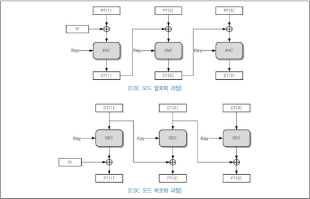

| CBC 모드 암호화(CBC_Enc )   | CBC 모드 암호화(CBC_Enc )                                                                                                                      | 고려사항         |
|-----------------------------|------------------------------------------------------------------------------------------------------------------------------------------------|------------------|
| 입력                        | － 초기값 $IV ( Len( IV) ==blocklen)$ － 평문 $PT = PT[1]\parallel\parallel PT[2]\parallel\parallel ⋯\parallel\parallel PT[m]$ － 비밀키 $Key$ | ①, , ②, , ③, , ④ |
| 출력                        | － 암호문 $CT = CT[1]\parallel\parallel CT[2]\parallel\parallel ⋯\parallel\parallel CT[m]$                                                     |                  |
| 1                           | $CT[0] = IV$                                                                                                                                   |                  |
| 2                           | for $i$ from $1$ to $m$ do                                                                                                                     |                  |
| 3                           | $X = PT[i] ⊕CT[i-1]$                                                                                                                           |                  |
| 4                           | $Y = ENC( X, Key)$                                                                                                                             |                  |
| 5                           | $CT[i] = Y$                                                                                                                                    |                  |
| 6                           | end for                                                                                                                                        |                  |

| CBC 모드 복호화(CBC_Dec )   | CBC 모드 복호화(CBC_Dec )                                                                                                                       | 고려사항   |
|-----------------------------|-------------------------------------------------------------------------------------------------------------------------------------------------|------------|
| 입력                        | － 초기값 $IV ( Len( IV) ==blocklen)$ － 암호문 $CT = CT[1]\parallel\parallel CT[2]\parallel\parallel ⋯\parallel\parallel CT[m] － 비밀키 $Key$ | ①, , ③     |
| 출력                        | － 평문 $PT = PT[1]\parallel\parallel PT[2]\parallel\parallel$ $⋯\parallel\parallel PT[m]                                                       |            |
| 1                           | $CT[0] = IV$                                                                                                                                    |            |
| 2                           | for $i$ from $1$ to $m$ do                                                                                                                      |            |
| 3                           | $X = CT[i]$                                                                                                                                     |            |
| 4                           | $Y = DEC( X, Key)$                                                                                                                              |            |
| 5                           | $PT[i] = Y ⊕CT[i-1]$                                                                                                                            |            |
| 6                           | end for                                                                                                                                         |            |

#### ① 비밀키 길이 확인

## 블록암호별 지원 가능한 키 길이 확인

- -

- ARIA, LEA, AES의 비밀키 길이: 128/192/256 비트

- SEED, HIGHT의 비밀키 길이: 128 비트

#### ② 안전한 비밀키 생성

블록암호 비밀키는 '중요보안매개변수(SSP) 생성' 방법으로 생성되어야 함

(검증대상 난수발생기를 이용하여 생성하는 등 안전한 방법으로 생성)

#### ③ 패딩 알고리즘

블록암호의 평문은 기본 블록길이의 배수가 되어야 하며, 그렇지 않을 경우 입력되는 평문의 길이가 기본 블록길이의 배수가 되도록 권고된 패딩방법 적용

패딩이 적용된 평문으로부터 생성된 암호문을 복호화할 경우에는, 복호화한 결과에서 패딩방법의 유효성을 검증한 후 패딩값을 제외해야 함

- ※ [부록] '안전한 패딩 방법' 참고

#### ④ 안전한 IV 생성

초기값 IV는 각각의 암호화 단계에서 생성

IV는 예측 불가능한 값이어야 하며, 다음 두 가지 방법을 통해 생성해야 함

- 1) 사용되지 않은(Unique) 값(예: nonce 등)을 암호화에 사용하는 비밀키 $Key$ 로 암호화한 결과값을 IV로 사용
- 2) 검증대상 난수발생기를 이용

## [공통] 제로화 수행

사용이 끝난 중요보안매개변수(SSP)에 대한 제로화 수행

- ※ [부록] '안전한 제로화' 참고

#### 다. CFB (Cipher Feedback)

|          | CFB 운영모드                      |
|----------|-----------------------------------|
| 권고사항 | － IV는 예측 불가능한 값이어야 함 |

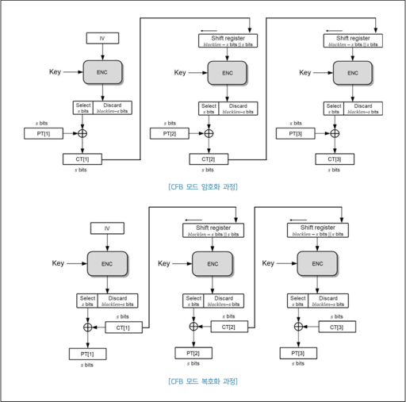

| CFB 모드 암호화(CFB_Enc )   | CFB 모드 암호화(CFB_Enc )                                                                                                                                                                                          | 고려사항         |
|-----------------------------|--------------------------------------------------------------------------------------------------------------------------------------------------------------------------------------------------------------------|------------------|
| 입력                        | － 초기값 $IV ( Len( IV) ==blocklen)$ － 피드백 길이 $s$ － 평문 $PT = PT[1]\parallel\parallel PT[2]\parallel\parallel ⋯\parallel\parallel PT[m] ( Len( PT[i]) == s (1≤i≤(m-1)), Len( PT[m]) ≤ s)$ － 비밀키 $Key$ | ①, , ②, , ③, , ④ |
| 출력                        | － 암호문 $CT = CT[1]\parallel\parallel CT[2]\parallel\parallel ⋯\parallel\parallel CT[m]$                                                                                                                         |                  |
| 1                           | $X = IV$                                                                                                                                                                                                           |                  |
| 2                           | for $i$ from $1$ to $(m-1)$ do                                                                                                                                                                                     |                  |
| 3                           | $Y = ENC( X, Key)$                                                                                                                                                                                                 |                  |
| 4                           | $CT[i] = PT[i]⊕ MSBs ( Y)$                                                                                                                                                                                         |                  |
| 5                           | $X = LSBblocklen-s ( X)\parallel\parallel CT[i]$                                                                                                                                                                   |                  |
| 6                           | end for                                                                                                                                                                                                            |                  |
| 7                           | $Y = ENC( X, Key)$                                                                                                                                                                                                 |                  |
| 8                           | $CT[m] = PT[m]⊕ MSBLen(PT[m]) ( Y)$                                                                                                                                                                                |                  |

| CFB 모드 복호화(CFB_Dec )   | CFB 모드 복호화(CFB_Dec )                                                                                                                                                                                            | 고려사항   |
|-----------------------------|----------------------------------------------------------------------------------------------------------------------------------------------------------------------------------------------------------------------|------------|
| 입력                        | － 초기값 $IV ( Len( IV) ==blocklen)$ － 피드백 길이 $s$ － 암호문 $CT = CT[1]\parallel\parallel CT[2]\parallel\parallel ⋯\parallel\parallel CT[m] ( Len( CT[i]) == s (1≤i≤(m-1)), Len( CT[m]) ≤ s)$ － 비밀키 $Key$ | ①, , ④     |
| 출력                        | － 평문 $PT = PT[1]\parallel\parallel PT[2]\parallel\parallel ⋯\parallel\parallel PT[m]$                                                                                                                             |            |
| 1                           | $X = IV$                                                                                                                                                                                                             |            |
| 2                           | for $i$ from $1$ to $(m-1)$ do                                                                                                                                                                                       |            |
| 3                           | $Y = ENC( X, Key)$                                                                                                                                                                                                   |            |
| 4                           | $PT[i] = CT[i]⊕ MSBs ( Y)$                                                                                                                                                                                           |            |
| 5                           | $X = LSBblocklen-s ( X)\parallel\parallel CT[i]$                                                                                                                                                                     |            |
| 6                           | end for                                                                                                                                                                                                              |            |
| 7                           | $Y = ENC( X, Key)$                                                                                                                                                                                                   |            |
| 8                           | $PT[m] = CT[m]⊕ MSBLen(CT[m]) ( Y)$                                                                                                                                                                                  |            |

#### ① 비밀키 길이 확인

## 블록암호별 지원 가능한 키 길이 확인

- ARIA, LEA, AES의 비밀키 길이: 128/192/256 비트

- SEED, HIGHT의 비밀키 길이: 128 비트

| 기 호         | 의 미                                                                                                |
|---------------|------------------------------------------------------------------------------------------------------|
| $[n] s$       | 음이 아닌 정수 $n(n < 2 s )$ 의 $s$ 비트 이진수 표현                                                 |
| $CTRK( A, B)$ | 초기값(카운터) $A$, , 평문 $B$, , 비밀키 $K$ 인 블록암호 CTR 운영모드 암호화 함수                    |
| $GHASHH$      | 서브키 $H$ 를 사용하는 GCM 모드의 내부 해시함수                                                      |
| $Mul X$       | 유한체 $GF(2 128 )$ 상에서 비트열 $X$ 와의 곱셈 연산                                                 |
| $N$           | CCM 운영모드에서 사용되는 논스                                                                       |
| $q$           | CCM 운영모드에서 평문 $P$ 의 길이를 명세하는 첫 번째 블록( $B0$ )에 포함되는 필드 $Q$ 의 바이트 길이 |


## 블록암호 운영모드(인증암호화)

- [블록암호 운영모드(일반)]은 메시지의 기밀성만 제공하는 반면, 인증암호화 운영모드는 메시지의 기밀성과 인증 기능을 동시에 제공하는 운영모드로 GCM과 CCM으로 구성된다. 블록암호는 검증대상 암호알고리즘인 ARIA, SEED, LEA, AES를 사용할 수 있다.


## 알고리즘 명세 및 구현 시 고려사항

#### 가. GCM

- GCM(Galois/Counter Mode)은 CTR 모드에 유한체 GF( $2128$ )에서의 곱 연산을 이용한 메시지 인증 기능을 추가한 형태로 메시지의 기밀성과 인증을 동시에 제공한다. 입력 메시지에 대하여 인증만을 제공하기 위해 적용되는 GCM은 GMAC이라 한다. GCM은 AE(Authenticated Encryption)와 AD(Authenticated Decryption) 두 부분으로 구분된다.

## □ 암호화 단계 (AE)

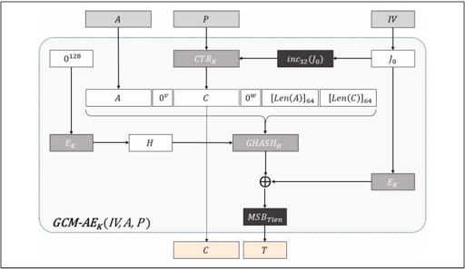

##### ■ CTR 및 GHASH 함수

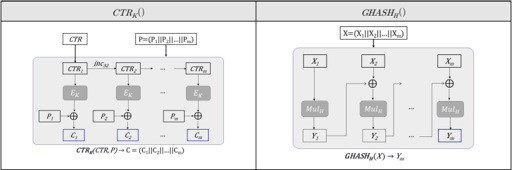

##### ■ MulH 연산

### 1. $X$ 입력

1.

$X=x0$

2.

3.

$R=13$

$Z0$

$x1$

$...x$

$127$

$\parallel\parallel 0$

$4$

$\parallel\parallel 1\parallel\parallel 0$

$120$

$=0128,V0=H$

## $MulH:Z←X∙H$ in $GF(2128$ $)$

4. for

4.

$i$

from

$0$

to

$127$

do

<!-- formula-not-decoded -->

5.

$Z128$

출력

|      | GCM 모드 암호화(GCM-AE )                                                                                                                                                                              | 고려사항    |
|------|-------------------------------------------------------------------------------------------------------------------------------------------------------------------------------------------------------|-------------|
| 입력 | － 평문 $P$ － 부가 인증 데이터 $A$ － 초기값 $IV$ － 비밀키 $K$ － 인증값 길이 $Tlen$                                                                                                                | ①, , ②, , ③ |
| 출력 | － 암호문 $C$ － 인증값 $T$ ( $Len( T)== Tlen$ )                                                                                                                                                      |             |
| 1    | $H = EK(0 128 )$                                                                                                                                                                                      |             |
| 2    | $if( Len( IV) == 96) J0 = IV\parallel\parallel 0 $31 \parallel\parallel 1 else s = 128$ ⌈ $Len( IV)==128$ ⌉ $- Len( IV) J0 = GHASHH( IV\parallel\parallel 0 s+64 \parallel\parallel $[Len( IV)] 64 )$ |             |
| 3    | $C = CTRK(inc 32 ( J0 ), P)$                                                                                                                                                                          |             |
| 4    | $v = 128$ ⌈ $Len( A)==128$ ⌉ $- Len( A)$                                                                                                                                                              |             |
| 5    | $w = 128$ ⌈ $Len( C)==128$ ⌉ $- Len( C)$                                                                                                                                                              |             |
| 6    | $S = GHASHH( A\parallel\parallel 0 v \parallel\parallel C \parallel\parallel 0 w \parallel\parallel [ Len( A)] 64 \parallel\parallel [ Len( C)] 64 )$                                                 |             |
| 7    | $T = MSBTlen ( EK( J0 )⊕ S)$                                                                                                                                                                          |             |
| 8    | (암호문 $C$, , 인증값 $T$) ) 출력                                                                                                                                                                     |             |

#### ① 입력값 길이 확인

## GCM 운영모드에서 허용되는 입력값 길이 확인

- -평문 $P$ : $1≤Len(P)≤239$ $-256$ 비트
- -부가 인증 데이터 $A$ : $0≤Len(A)≤264-1$ 비트
- -초기값 $IV$ : $1≤Len(IV)≤264-1$ 비트
- -인증값 길이 $Tlen$ : $112≤Tlen≤128$ 비트

## 블록암호 기반 난수발생기


## 범위

- q 본 본 문서에서는 ISO/IEC 18031에 명시된 난수발생기 중 블록암호 기반 난수발생기(CTR\_DRBG)를 구현할 경우의 고려사항을 기술한다.

| 구분     | 적용 알고리즘   | 키 길이     |
|----------|-----------------|-------------|
| CTR_DRBG | ARIA, LEA, AES  | 128/192/256 |
| CTR_DRBG | SEED, HIGHT     | 128         |


## 관련표준

- [KS X ISO/IEC 18031] 난수발생기 (2023)
- [TTAK.KO-12.0189/R2] 결정론적 난수 발생기 -제1부- 블록 암호 기반 난수 발생기 (2022)
- [ISO/IEC 18031] Random bit generation (2025)


## 기호

| 기 호                  | 의 미                                                                              |
|------------------------|------------------------------------------------------------------------------------|
| $Len( X)$              | 비트열 $X$ 의 비트 길이                                                            |
| $bc_security_strength$ | 블록암호 알고리즘의 보안강도                                                       |
| $blocklen$             | 블록암호 알고리즘이 한 번의 연산으로 처리할 수 있는 1블록의 길이 (비트)            |
| $keylen$               | 블록암호 알고리즘의 키 길이 (비트)                                                 |
| $seedlen$              | DRBG 내부 메커니즘에 사용되는 $seed$ 의 비트 길이 ( $seedlen = blocklen +keylen$ ) |
| $ctrlen$               | 카운터 필드의 비트 길이                                                            |
| ⌈ $n$ ⌉                | $n$ 보다 크거나 같은 정수 중에서 최소값                                            |
| $min{s$ ∈ $S : C }$    | 집합 $S(= {s 1 , s 2 , ... , s n })$ 의 원소 중 조건 $C$ 를 만족하는 최소값        |
| $Get_ Entropy( A)$     | 보안강도 $A$ 이상을 갖는 임의 길이의 비트열을 잡음원으로부터 수집하는 함수         |
| $nonce$                | DRBG 초기화 단계에서 사용되는 논스                                                 |
| $reseed_required$      | 리씨드가 요구됨을 나타내는 상태값                                                  |
| $Null$                 | Empty String                                                                       |
| $0 n$                  | $n$ 길이의 연속된 $0$ 비트열 (Ex. $0 5 = 00000$ , $0 3 = 000$ )                    |
| $1 n$                  | $n$ 길이의 연속된 $1$ 비트열 (Ex. $1 5 = 11111$ , $1 3 = 111$ )                    |
| $[n] s$                | 음이 아닌 정수 $n(n < 2 s )$ 의 $s$ 비트 이진수 표현                               |
| $min( A, B)$           | $A$ 와 $B$ 중에서 작은 값                                                          |

| 기 호        | 의 미                                                                                                                                                           |
|--------------|-----------------------------------------------------------------------------------------------------------------------------------------------------------------|
| $EK( X)$     | 비밀키 $K$ 를 이용하여 입력값 $X$ 를 암호화하는 블록암호 암호화 함수                                                                                            |
| $MSBi ( X)$  | 주어진 비트열 $X$ 의 상위(왼쪽) $i$ 개 비트열                                                                                                                   |
| $LSBi ( X)$  | 주어진 비트열 $X$ 의 하위(오른쪽) $i$ 개 비트열                                                                                                                 |
| $inc n ( X)$ | 비트열 $X$ 의 하위 $n$ 비트를 1만큼 증가시키는 함수 (상위 $Len( X)-n$ 비트는 고정) ※ $inc n ( X)= MSBLen(X)-n ( X)\parallel\parallel (( LSBn ( X)+1) mod 2 n )$ |


## 블록암호 기반 난수발생기

- CTR\_DRBG는 CTR모드(Counter mode)로 동작하는 블록암호 알고리즘을 사용하는 DRBG이다. CTR\_DRBG의 초기화 함수, 리씨드 및 난수 생성 함수에 블록암호가 사용된다. CTR\_DRBG는 초기화와 리씨드 함수에서 유도함수를 사용하는 경우와 유도함수를 사용하지 않는 경우의 2가지 형태로 구현될 수 있다. CTR\_DRBG의 최대 안전성은 사용된 블록암호와 키 길이의 안전성에 의존한다.

## q 난 난수발생기의 기본적인 구성요소는 다음과 같다. .

| 구성요소                        | 의 미                                                                                                                                                                                                          |
|---------------------------------|----------------------------------------------------------------------------------------------------------------------------------------------------------------------------------------------------------------|
| 엔트로피 입력 (Entropy Input)   | 난수발생기에 (평가된 엔트로피에 해당하는) 예측 불가능성을 제공하기 위해 입력되는 비트열                                                                                                                        |
| 인스턴스 초기화 (Instantiation) | 논리적으로 독립적인 새로운 난수발생기 인스턴스를 초기 설정하는 과정                                                                                                                                            |
| 리씨드 (Reseed)                 | 난수발생기 내부 상태에 영향을 미치는 새로운 정보(엔트로피 및 추가 입력값)을 획득하여 새로운 내부 상태로 갱신하는 과정                                                                                          |
| 생성 (Generation)               | 인스턴스 초기화 또는 리씨드 후 수행하며, 요청된 의사난수 비트열을 생성하는 과정                                                                                                                                |
| 내부 상태 (Internal State)      | 난수발생기 동작 시 필요에 의해 관리되는 모든 정보의 집합 보안강도 및 플래그와 같은 정책적인 데이터와 난수생성 시 사용되는 상태값 등 운영 데이터로 구성되며, 비밀 정보와 비밀이 아닌 정보가 모두 포함될 수 있음 |

## q 다 다음 요소들은 선택적인 요소이다. .

| 구성요소                               | 의 미                                                                                                                                                   |
|----------------------------------------|---------------------------------------------------------------------------------------------------------------------------------------------------------|
| 추가 입력 (Additional Input)           | 선택적으로 사용되는 입력값으로, 리씨드 및 생성 과정에서 활용                                                                                            |
| 개별화 문자열 (Personalization String) | 선택적으로 사용되는 입력값으로, 인스턴스 초기화 과정에서 개별화 정보를 제공하기 위해 사용됨 장치일련번호, 사용자 및 응용프로그램 ID 등이 사용될 수 있음 |
| 논스 (Nonce)                           | 인스턴스 초기화 과정에 사용되는 반복되지 않는 가변적인 값으로 난수발생기 구현 방법에 따라 적용여부가 결정됨 예) 타임스탬프, 일련번호 또는 이들의 조합   |


## 알고리즘 명세 및 구현 시 고려사항

#### 가. 난수발생기 일반

- □ DRBG 난수 생성 과정

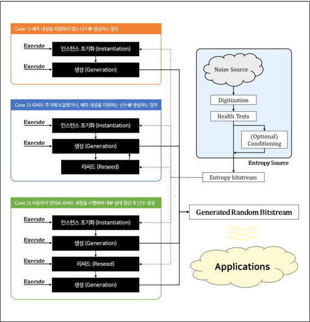

## □ 인스턴스 초기화 단계

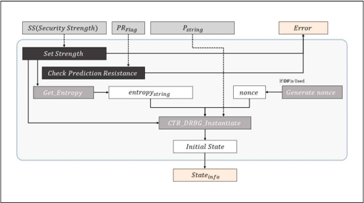

|      | DRBG 인스턴스 초기화(Instantiation) )                                                                    | 고려사항   |
|------|----------------------------------------------------------------------------------------------------------|------------|
| 입력 | － 요구 보안강도 $SS$ － 예측내성 지원 여부 $PRFlag$ ( $TRUE$ 또는 $FALSE$) ) － 개별화 문자열 $Pstring$ | ①          |
| 출력 | － 내부 상태 또는 식별값 $State info$                                                                    |            |
| 1    | $if( SS > bc_security_strength)$ Error 출력                                                              | ①          |
| 2    | $if( PRFlag == TRUE)$ && (구현물이 예측내성을 지원하지 않는 경우) Error 출력                             |            |
| 3    | $strength = min{tmp$ ∈ ${112, 128, 192, 256} : tmp ≥ SS }$                                               |            |
| 4    | $entropy string = Get_ Entropy(strength)$                                                                | ②          |
| 5    | if(유도함수 사용 시), $nonce$ 생성                                                                       | ③          |
| 6    | $Initial_ State = CTR_ DRBG_ Instantiate(entropy string , nonce, Pstring , strength)$                    |            |
| 7    | $State info = [I [Initial_ State] or [I [Indicator of Initial_ State]$                                   |            |
| 8    | $State info$ 출력                                                                                        |            |

#### ① 입력값 확인

## 요구 보안강도 $SS$ : 사용되는 블록암호 알고리즘의 보안강도보다 작거나 같아야 함

## 개별화 문자열 길이 확인

- -유도함수 사용 시 : $0≤Len(Pstring$ $)≤2$ $35$ 비트
- -유도함수 미사용 시 : $0≤Len(Pstring$ $)≤seedlen$ 비트 ( $seedlen=blocklen+keylen$ )

#### ② 엔트로피 수집 유효성 확인

## 엔트로피 수집함수가 건전성 테스트를 통과한 잡음원을 수집하는지 확인

## 수집된 엔트로피의 길이 및 보안강도 확인

- -유도함수 사용 시 : $Len(entropystring$ $)≤235$ 비트
- -
- 유도함수 미사용 시 : $Len(entropystring$ $)==seedlen$ 비트 ( $seedlen=blocklen+keylen$ )
- -$entropystring$ 의 엔트로피가 $strength$ 이상이어야 함
- ※ 유도함수 미사용 시, $entropy$ $string$ 은 Full-entropy를 가져야 함

#### ③ 논스 생성 확인

논스는 초기화 연산의 각 실행에 대해 유일해야 하며, 비밀값일 필요는 없음

- -사용된 논스 값은 CSP로 관리되어야 함

## 생성된 논스 길이 확인

- -$Len(nonce)$ ≥ ( $strength==2$ )

## [공통] 작동상태 관리 및 제로화 수행

## 각 난수발생기 인스턴스는 독립적인 내부상태를 가져야 함

사용이 끝난 중요보안매개변수(SSP)에 대한 제로화 수행

- ※ [부록] '안전한 제로화' 참고

## □ 리씨드 단계

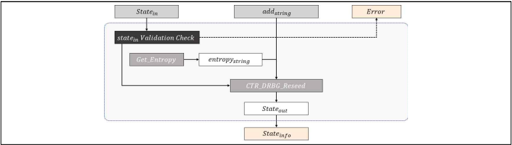

|      | DRBG 리씨드( (Reseed) )                                                   | 고려사항   |
|------|---------------------------------------------------------------------------|------------|
| 입력 | － 내부 상태 또는 식별값 $State in$ － 추가 입력 $add string$             | ①          |
| 출력 | － (갱신된) 내부 상태 또는 식별값 $State info$                            |            |
| 1    | 입력된 $State in$ 유효성 확인                                             |            |
| 2    | $entropy string = Get_ Entropy(strength)$                                 | ②          |
| 3    | $State out = CTR_ DRBG_ Reseed( State in , entropy string , add string )$ |            |
| 4    | $State info = [State out ] or [I [Indicator of State out ]$               |            |
| 5    | $State info$ 출력                                                         |            |

#### ① 입력값 확인

## 추가 입력 길이 확인

- 유도함수 사용 시 : $)≤2$ $35$

$0≤Len(addstring$ 비트

- 유도함수 미사용 시 : $0≤Len(addstring$ $)≤seedlen$ 비트 ( $seedlen=blocklen+keylen$ )

#### ② 엔트로피 수집 유효성 확인

## 엔트로피 수집함수가 건전성 테스트를 통과한 잡음원을 수집하는지 확인

## 수집된 엔트로피의 길이 및 보안강도 확인

- -유도함수 사용 시 : $)≤235$

$Len(entropystring$ 비트

- -유도함수 미사용 시 : $Len(entropystring$ $)==seedlen$ 비트 ( $seedlen=blocklen+keylen$ )
- -$entropystring$ 의 엔트로피가 $strength$ 이상이어야 함
- ※ 유도함수 미사용 시, $entropy$ $string$ 은 Full-entropy를 가져야 함

## [공통] 작동상태 관리 및 제로화 수행

## 각 난수발생기 인스턴스는 독립적인 내부상태를 유지해야 함

## 사용이 끝난 중요보안매개변수(SSP)에 대한 제로화 수행

- ※ [부록] '안전한 제로화' 참고

## □ 생성 단계

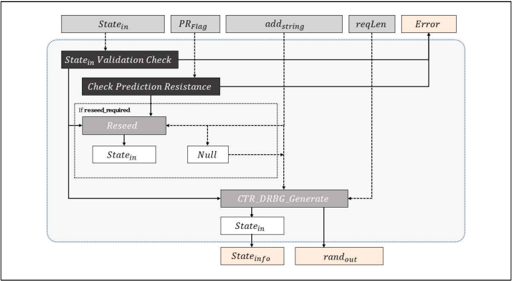

|      | DRBG 생성( (Generation) )                                                                                                                               | 고려사항   |
|------|---------------------------------------------------------------------------------------------------------------------------------------------------------|------------|
| 입력 | － 내부 상태 또는 식별값 $State in$ － 예측내성 요청 여부 $PRFlag$ ( $TRUE$ 또는 $FALSE$) ) － 추가 입력 $add string$ － 난수 출력 요청 길이 $req Len$  | ①          |
| 출력 | － (갱신된) 내부 상태 또는 식별값 $State info$ － 생성된 난수 비트열 $rand out$                                                                         |            |
| 1    | 입력된 $State in$ 유효성 확인                                                                                                                           |            |
| 2    | if(구현물이 예측내성을 지원하지 않는 경우) && $if( PRFlag == TRUE)$ Error 출력                                                                          |            |
| 3    | $reseed_required_flag = FALSE$                                                                                                                          |            |
| 4    | $if(reseed_required_flag == TRUE)$ 또는 $if( PRFlag == TRUE) State in = Reseed( State in , add string ) add string = Null reseed_required_flag = FALSE$ |            |
| 5    | $(status, rand out , State in ) = CTR_ DRBG_ Generate( State in , add string , req Len)$                                                                |            |
| 6    | $if(status == reseed_required) reseed_required_flag = TRUE$ 단계 4로 이동                                                                               |            |
| 7    | $State info = [State in ] or [I [Indicator of State in ]$                                                                                               |            |
| 8    | $State info$ 및 $rand out$ 출력                                                                                                                         |            |

#### ① 입력값 확인

## 추가 입력 길이 확인

- -유도함수 사용 시 : $0≤Len(addstring$ $)≤2$ $35$ 비트
- -유도함수 미사용 시 : $0≤Len(addstring$ $)≤seedlen$ 비트 ( $seedlen=blocklen+keylen$ )

## 난수 출력 요청 길이 확인 (카운터 필드 길이 $ctrlen$ : $4≤ctrlen≤blocklen$ 비트)

- -$reqLen≤min((2ctrlen$ $-4)×blocklen),LIMIT)$ 비트
- ARIA, SEED, LEA, AES : $LIMIT=219$
- HIGHT : $LIMIT=213$

## [공통] 작동상태 관리 및 제로화 수행

## 각 난수발생기 인스턴스는 독립적인 내부상태를 유지해야 함

사용이 끝난 중요보안매개변수(SSP)에 대한 제로화 수행

※ [부록] '안전한 제로화' 참고

#### 나. CTR-DRBG

##### ■ CTR-DRBG 내부 블록암호 알고리즘별 주요 특징 (길이 단위 : 비트)

| 구분                                                       | ARIA/LEA/AES -128                   | ARIA/LEA/AES -192                   | ARIA/LEA/AES -256                   | SEED                                | HIGHT                               |
|------------------------------------------------------------|-------------------------------------|-------------------------------------|-------------------------------------|-------------------------------------|-------------------------------------|
| 보안강도 ( $bc_security_strength$ )                        | $128$                               | $192$                               | $256$                               | $128$                               | $128$                               |
| 블록 길이 ( $blocklen$ )                                   | $128$                               | $128$                               | $128$                               | $128$                               | $64$                                |
| 키 길이 ( $keylen$ )                                       | $128$                               | $192$                               | $256$                               | $128$                               | $128$                               |
| 카운터 필드 길이 ( $ctrlen$ )                              | $4 ≤ctrlen ≤blocklen$               | $4 ≤ctrlen ≤blocklen$               | $4 ≤ctrlen ≤blocklen$               | $4 ≤ctrlen ≤blocklen$               | $4 ≤ctrlen ≤blocklen$               |
| 시드 길이 ( $seedlen$ )                                    | $256$                               | $320$                               | $384$                               | $256$                               | $192$                               |
| 난수 생성 최대 요청 길이 ( $C = (2ctrlen - 4) ×blocklen$ ) | $min( C , 2 19 )$                   | $min( C , 2 19 )$                   | $min( C , 2 19 )$                   | $min( C , 2 19 )$                   | $min( C , 2 13$                     |
| 리씨드 주기 ( $reseed_interval$ )                          | $2 48$                              | $2 48$                              | $2 48$                              | $2 48$                              | $2 32$                              |
| 유도함수 사용 시                                           | 유도함수 사용 시                    | 유도함수 사용 시                    | 유도함수 사용 시                    | 유도함수 사용 시                    | 유도함수 사용 시                    |
| 엔트로피 입력 최소 길이                                    | $strength (in Instantiation Phase)$ | $strength (in Instantiation Phase)$ | $strength (in Instantiation Phase)$ | $strength (in Instantiation Phase)$ | $strength (in Instantiation Phase)$ |
| 엔트로피 입력 최대 길이                                    | $2 35$                              | $2 35$                              | $2 35$                              | $2 35$                              | $2 35$                              |
| 개별화문자열 최대 길이                                     | $2 35$                              | $2 35$                              | $2 35$                              | $2 35$                              | $2 35$                              |
| 추가입력 최대 길이                                         | $2 35$                              | $2 35$                              | $2 35$                              | $2 35$                              | $2 35$                              |
| 유도함수 미사용 시                                         | 유도함수 미사용 시                  | 유도함수 미사용 시                  | 유도함수 미사용 시                  | 유도함수 미사용 시                  | 유도함수 미사용 시                  |
| 엔트로피 입력 최소 길이                                    | $seedlen$                           | $seedlen$                           | $seedlen$                           | $seedlen$                           | $seedlen$                           |
| 엔트로피 입력 최대 길이                                    | $seedlen$                           | $seedlen$                           | $seedlen$                           | $seedlen$                           | $seedlen$                           |
| 개별화문자열 최대 길이                                     | $seedlen$                           | $seedlen$                           | $seedlen$                           | $seedlen$                           | $seedlen$                           |
| 추가입력 최대 길이                                         | $seedlen$                           | $seedlen$                           | $seedlen$                           | $seedlen$                           | $seedlen$                           |

## □ 초기화 함수 ( $CTR\_DRBG\_Instantiate$ )

##### ■ 유도함수 $DF$ 를 사용하는 경우

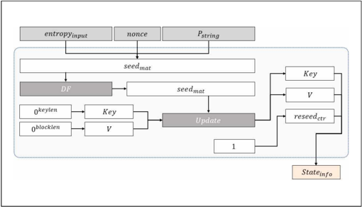

##### ■ 유도함수를 사용하지 않는 경우

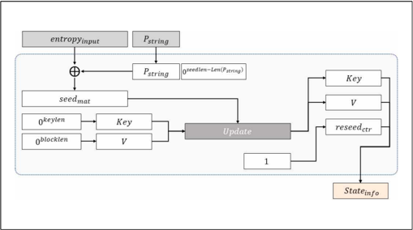

|      | CTR-DRBG 초기화 함수(CTR_DRBG_Instantiate) )                                                                          | 고려사항   |
|------|-----------------------------------------------------------------------------------------------------------------------|------------|
| 입력 | － 엔트로피 입력 $entropy input$ － (유도함수 사용 시) 논스 $nonce$ － 개별화 문자열 $Pstring$ － 보안강도 $strength$ | ①          |
| 출력 | － 내부 상태 또는 식별값 $state info$                                                                                 |            |
|      | 유도함수를 사용하는 경우                                                                                              |            |
| 1    | $seed mat = entropy input \parallel\parallel nonce \parallel\parallel Pstring$                                        |            |
| 2    | $seed mat = DF (seed mat , seedlen)$                                                                                  | ②          |
| 3    | -                                                                                                                     |            |
|      | 유도함수를 사용하지 않는 경우                                                                                         |            |
| 1    | $temp = Len( Pstring )$                                                                                               |            |
| 2    | $if(temp <seedlen) Pstring = Pstring \parallel\parallel 0 seedlen-temp$                                               |            |
| 3    | $seed mat = entropy input ⊕Pstring$                                                                                   |            |
| 4    | $Key = 0 keylen$                                                                                                      |            |
| 5    | $V = 0 blocklen$                                                                                                      |            |
| 6    | $( Key, V ) = Update (seed mat , Key , V )$                                                                           |            |
| 7    | $reseed ctr = 1$                                                                                                      |            |
| 8    | ( $Key$ , $V$, , $reseed ctr$ )가 포함된 $state info$ 출력                                                            |            |

- ① 입력된 보안강도( $strength$ ) 이상의 안전성을 갖는 블록암호 알고리즘을 사용하는지 확인

#### ② 블록암호 알고리즘별 설정되는 시드 길이 확인

| - ARIA-128, LEA-128,   | AES-128, SEED : 256 비트              |
|------------------------|---------------------------------------|
| -                      | ARIA-192, LEA-192, AES-192 : 320 비트 |
| - ARIA-256,            | LEA-256, AES-256 : 384 비트           |
| -                      | HIGHT : 192 비트                      |

## [공통] 제로화 수행

사용이 끝난 중요보안매개변수(SSP)에 대한 제로화 수행

※ [부록] '안전한 제로화' 참고

## □ 업데이트 함수 ( $Update$ )

|      | 업데이트 함수(Update) )                                                                                                     | 고려사항   |
|------|-----------------------------------------------------------------------------------------------------------------------------|------------|
| 입력 | － 입력 비트열 $input str$ － 난수발생기 상태값 $Key$ － 난수발생기 상태값 $V$                                              |            |
| 출력 | － (갱신된) 난수발생기 상태값 $Key$ － (갱신된) 난수발생기 상태값 $V$                                                       |            |
| 1    | $temp = Null$                                                                                                               |            |
| 2    | $While( Len(temp) < seedlen)$                                                                                               |            |
| 3    | $if(ctrlen < blocklen) inc = ( LSBctrlen ( V) +1) mod 2 ctrlen V = MSBblocklen-ctrlen ( V) \parallel\parallel [inc] ctrlen$ |            |
| 4    | $else V = ( V +1) mod 2 blocklen$                                                                                           |            |
| 5    | $blk = EKey ( V)$                                                                                                           |            |
| 6    | $temp = temp \parallel\parallel blk$                                                                                        |            |
| 7    | $temp = MSBseedlen (temp)$                                                                                                  |            |
| 8    | $temp = temp ⊕input str$                                                                                                    |            |
| 9    | $Key = MSBkeylen (temp)$                                                                                                    |            |
| 10   | $V = LSBblocklen (temp)$                                                                                                    |            |
| 11   | ( $Key$ , $V$) ) 출력                                                                                                       |            |

## [공통] 제로화 수행

사용이 끝난 중요보안매개변수(SSP)에 대한 제로화 수행

※ [부록] '안전한 제로화' 참고

## □ 유도함수 ( $DF$ )

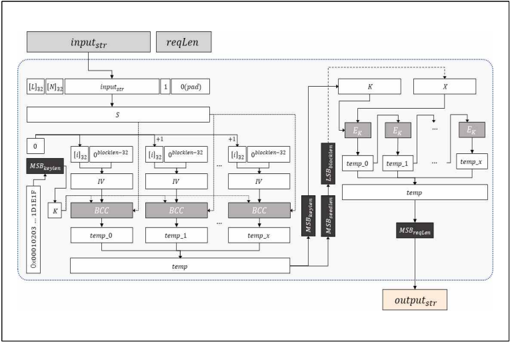

| BCC 함수( (BCC) )   | 고려사항                                                                                           |
|---------------------|----------------------------------------------------------------------------------------------------|
| 입력                | － 키 $K$ － 입력 비트열 $input str$                                                               |
| 출력                | － 출력 비트열 $output str$                                                                        |
| 1                   | $chain = 0 blocklen$                                                                               |
| 2                   | $n = Len(input str )==blocklen$                                                                    |
| 3                   | $block 1 \parallel\parallel block 2 \parallel\parallel ... \parallel\parallel block n = input str$ |
| 4                   | for $i$ from $1$ to $n$ do                                                                         |
| 5                   | $temp = chain ⊕blocki chain = EK(temp)$                                                            |
| 6                   | end for                                                                                            |
| 7                   | $output str = chain$                                                                               |
| 8                   | $output str$ 출력                                                                                  |

|      | CTR-DRBG 유도함수( (DF) )                                                                                                                             | 고려사항   |
|------|-------------------------------------------------------------------------------------------------------------------------------------------------------|------------|
| 입력 | － 입력 비트열 $input str$ － 요청 길이(비트) $req Len$                                                                                               |            |
| 출력 | － 출력 비트열 $output str$                                                                                                                           |            |
| 1    | $L = Len(input str )==8$                                                                                                                              |            |
| 2    | $N = req Len==8$                                                                                                                                      |            |
| 3    | $S = [L] 32 \parallel\parallel [N] 32 \parallel\parallel input str \parallel\parallel 1 \parallel\parallel 0 7$                                       |            |
| 4    | $While( Len( S) mod blocklen ≠0) S = S\parallel\parallel 0 $8$                                                                                        |            |
| 5    | $temp = Null$                                                                                                                                         |            |
| 6    | $i = 0$                                                                                                                                               |            |
| 7    | $K = MSBkeylen ($ 0x00010203 ... 1D1E1F $)$                                                                                                           |            |
| 8    | $While( Len(temp) < seedlen) IV = [i] 32 \parallel\parallel 0 blocklen-32 temp=temp \parallel\parallel BCC ( K, ( IV\parallel\parallel S)) i = $i +1$ |            |
| 9    | $K = MSBkeylen (temp)$                                                                                                                                |            |
| 10   | $X = LSBblocklen ( MSBseedlen (temp))$                                                                                                                |            |
| 11   | $temp = Null$                                                                                                                                         |            |
| 12   | $While( Len(temp) < req Len) X = EK( X) temp=temp \parallel\parallel X$                                                                               |            |
| 13   | $output str = MSBreq Len (temp)$                                                                                                                      |            |
| 14   | $output str$ 출력                                                                                                                                     |            |

## [공통] 제로화 수행

사용이 끝난 중요보안매개변수(SSP)에 대한 제로화 수행

※ [부록] '안전한 제로화' 참고

## □ 리씨드 함수 ( $CTR\_DRBG\_Reseed$ )

##### ■ 유도함수 $DF$ 를 사용하는 경우

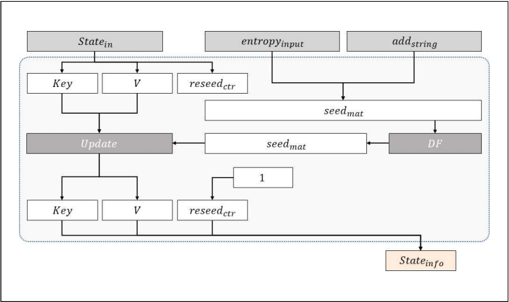

##### ■ 유도함수를 사용하지 않는 경우

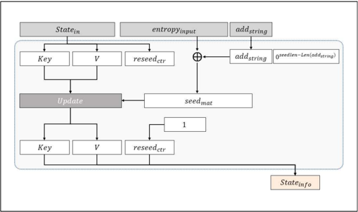

| CTR-DRBG   | 리씨드 함수(CTR_DRBG_Reseed) )                                                                 | 고려사항   |
|------------|------------------------------------------------------------------------------------------------|------------|
| 입력       | － 내부 상태 또는 식별값 $state in$ － 엔트로피 입력 $entropy input$ － 추가 입력 $add string$ |            |
| 출력       | － (갱신된) 내부 상태 또는 식별값 $state info$                                                 |            |
|            | 유도함수를 사용하는 경우                                                                       |            |
| 1          | $seed mat = entropy input \parallel\parallel add string$                                       |            |
| 2          | $seed mat = DF (seed mat , seedlen)$                                                           | ①          |
| 3          | -                                                                                              |            |
|            | 유도함수를 사용하지 않는 경우                                                                  |            |
| 1          | $temp = Len(add string )$                                                                      |            |
| 2          | $if(temp <seedlen) add string = add string \parallel\parallel 0 seedlen-temp$                  |            |
| 3          | $seed mat = entropy input ⊕add string$                                                         |            |
| 4          | $( Key, V ) = Update (seed mat , Key , V )$                                                    |            |
| 5          | $reseed ctr = 1$                                                                               |            |
| 6          | ( $Key$ , $V$, , $reseed ctr$ )가 포함된 $state info$ 출력                                     |            |

#### ① 블록암호 알고리즘별 설정되는 시드 길이 확인

- ARIA-128, LEA-128, AES-128, SEED : 256 비트

- ARIA-192, LEA-192, AES-192 : 320 비트

- ARIA-256, LEA-256, AES-256 : 384 비트

- HIGHT : 192 비트

## [공통] 제로화 수행

사용이 끝난 중요보안매개변수(SSP)에 대한 제로화 수행

※ [부록] '안전한 제로화' 참고

## □ 생성 함수 ( $CTR\_DRBG\_Generate$ )

##### ■ 유도함수 $DF$ 를 사용하는 경우

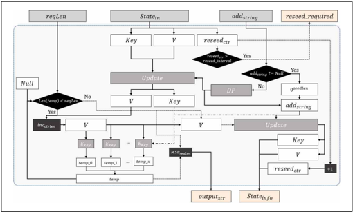

##### ■ 유도함수를 사용하지 않는 경우

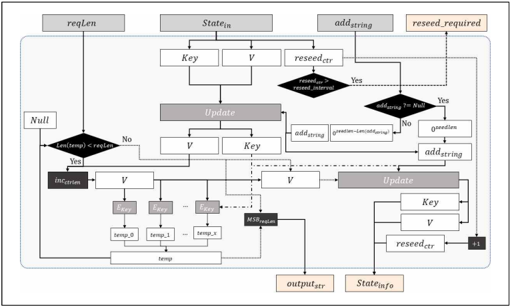

|      | CTR-DRBG 생성 함수(CTR_DRBG_Generate) )                                                                                     | 고려사항   |
|------|-----------------------------------------------------------------------------------------------------------------------------|------------|
| 입력 | － 내부 상태 또는 식별값 $state in$ － 추가 입력 $add string$ － 난수 출력 요청 길이(비트) $req Len$                        |            |
| 출력 | － 동작 반환값 $indicator$ － 생성된 난수 비트열 $output str$ － (갱신된) 내부 상태 또는 식별값 $state info$                |            |
| 1    | $if(reseed ctr > reseed_interval) indicator$ = $reseed_required indicator$ 출력                                             | ①          |
|      | 유도함수를 사용하는 경우                                                                                                    | ②          |
| 2    | $if(add string ≠ Null) add string = DF (add string , seedlen) ( Key, V) = Update(add string , Key , V)$                     |            |
| 3    | $else add string = 0 seedlen$                                                                                               |            |
| 4    | -                                                                                                                           |            |
| 5    | -                                                                                                                           |            |
|      | 유도함수를 사용하지 않는 경우                                                                                               | ②          |
| 2    | $if(add string ≠ Null) temp = Len(add string )$                                                                             |            |
| 3    | $if(temp < seedlen) add string = add string \parallel\parallel 0 seedlen-temp$                                              |            |
| 4    | $( Key, V) = Update(add string , Key , V)$                                                                                  |            |
| 5    | $else add string = 0 seedlen$                                                                                               |            |
| 6    | $temp = Null$                                                                                                               |            |
| 7    | $While( Len(temp) < req Len)$                                                                                               |            |
| 8    | $if(ctrlen < blocklen) inc = ( LSBctrlen ( V) +1) mod 2 ctrlen V = MSBblocklen-ctrlen ( V) \parallel\parallel [inc] ctrlen$ |            |
| 9    | $else V = ( V +1) mod 2 blocklen$                                                                                           |            |
| 10   | $blk = EKey ( V)$                                                                                                           |            |
| 11   | $temp = temp \parallel\parallel blk$                                                                                        |            |
| 12   | $output str = MSBreq Len (temp)$                                                                                            |            |
| 13   | $( Key, V ) = Update (add string , Key , V )$                                                                               |            |
| 14   | $reseed ctr = reseed ctr +1$                                                                                                |            |
| 15   | $indicator = SUCCESS$                                                                                                       |            |
| 16   | $indicator$ , $output str$ , ( $Key$ , $V$, , $reseed ctr$ )가 포함된 $state info$ 출력                                     |            |

#### ① 리씨드 주기 확인

- -

- ARIA, SEED, LEA, AES : $reseed\_interval$ $≤248$

- HIGHT : $reseed\_interval$ $≤232$

#### ② 블록암호 알고리즘별 설정되는 시드 길이 확인

- ARIA-128, LEA-128, AES-128, SEED : 256 비트

- ARIA-192, LEA-192, AES-192 : 320 비트

- ARIA-256, LEA-256, AES-256 : 384 비트

- HIGHT : 192 비트

## [공통] 제로화 수행

사용이 끝난 중요보안매개변수(SSP)에 대한 제로화 수행

- ※ [부록] '안전한 제로화' 참고


## 안전한 제로화 1

#### 가. 최적화로 인한 생략방지

- □ 컴파일러 최적화 옵션으로 인한 제로화 코드 생략방지
- － 제로화 코드는 사용된 메모리의 값을 초기화한 후 메모리 자원을 반납하는 절차이기 때문에 컴파일러 최적화 옵션에 따라 생략되는 경우가 존재함
- － 제로화 코드가 컴파일러 옵션에 의해 생략되는 것을 방지하기 위하여 다음의 방법 사용 가능

| 대응방법             | 내용                                                                                                                                |
|----------------------|-------------------------------------------------------------------------------------------------------------------------------------|
| Fake 코드이용        | 제로화를 수행하는 API에 연산의 결과에 영향을 주지 않고 추가 연산만을 수행하는 코드를 삽입하여 컴파일러 최적화로 인한 코드 생략 방지 |
| Volatile 키워드 사용 | volatile은 컴파일러 옵션 최적화의 영향을 받지 않도록 하는 키워드이기 때문에 변수 선언 또는 제로화 API 구현 시 volatile 키워드 적용  |
| SecureZeroMemory     | 윈도우 환경에서는 SecureZeroMemory API를 제공하여 코드생략 방지 (내부적으로 volatile 키워드를 이용하고 있음)                        |

#### 나. 컨텍스트 제로화

- □ 컨텍스트 포인터 제로화 시 다중 제로화 필요
- － 암호관련 API 수행 시 필요한 인자를 컨텍스트 형태로 전달하는 경우가 있으며 컨텍스트에는 다음과 같이 포인터 변수들이 포함되기도 함

```
컨텍스트 정의 typedef struct _KCMVP_BIGNUM_{ int sign;                    // 부호 unsigned int numOfLimb;    // 큰수 저장에 사용된 워드 개수 unsigned int* limb;        // 큰수를 저장한 메모리 포인터 }KCMVP_BIGNUM typedef struct _KCMVP_RSA_PrivateKey_{ KCMVP_BIGNUM  *n; // 모듈러스 값 KCMVP_BIGNUM  *d; // 개인키 d 값 KCMVP_BIGNUM  *p; // 개인키 p 값 KCMVP_BIGNUM  *q; // 개인키 q 값 } KCMVP_RSA_PrivateKey;
```

- － 다음은 컨텍스트 내부에 포함된 포인터 변수들이 참조하는 메모리 제로화를 누락한 경우임
- － 다음은 컨텍스트에 포함된 포인터 변수들이 참조하는 메모리들을 확인하여 올바르게 제로화하고 있는 경우임

```
잘못된 제로화 BOOL KCMVP_RSA_PrivateKey_Zeroize(KCMVP_RSA_PrivateKey* privKey){ if(priv Key != NULL) { SecureZeroMemory(privKey, sizeof(KCMVP_RSA_PrivateKey)); free(privKey); } ... }
```

```
올바른 제로화 BOOL KCMVP_RSA_PrivateKey_Zeroize(KCMVP_RSA_PrivateKey* privKey){ if(priv Key != NULL){ if(privKey->n != NULL){ KCMVP_BIGNUM_zeroize(privKey->n); free(privKey->n); } if(privKey->d != NULL){ KCMVP_BIGNUM_zeroize(privKey->d); free(privKey->d); } if(privKey->p != NULL){ KCMVP_BIGNUM_zeroize(privKey->p); free(privKey->p); } if(privKey->q != NULL){ KCMVP_BIGNUM_zeroize(privKey->q); free(privKey->q); } } ... } BOOL KCMVP_BIGNUM_zeroize(KCMVP_BIGNUM* bNum){ ... if(bNum → limb != NULL){ SecureZeroMemory(bNum → limb, WORDS_FOR_2048); free(bNum → limb); } ... }
```

#### 다. 제로화 종류

- □ 절차적 제로화
- － 하나의 API 내부에서 사용이 끝난 중요보안매개변수를 제로화
- ※ 평문의 마지막 블록에 대한 암호화를 수행하는 Encrypt\_Final()에서 암호화에 사용된 라운드키 제로화
- － API 외부에서 API 내부로 복사되어 사용된 데이터에 대한 제로화
- － API 내부에서 생성되어 사용된 데이터를 API 반환 전 제로화

```
절차적 제로화 예시 -난수발생기 인스턴스 생성 후 int KCMVP_drbg_instantiate(DRBG_CTX *dctx, const unsigned char *pers, size_t perslen){ // entropy: 엔트로피를 수집하는 내부 변수 size_t entlen = 0; unsigned char *entropy = NULL; ... // 사용이 끝난 엔트로피를 수집하는 내부 변수를 제로화함 KCMVP_cleanup_entropy(dctx, entropy, entlen); ... }
```

## 절차적 제로화 예시 -대칭키 암호화 수행 후

```
// 대칭키 암호화 API int Encrypt_Final(unsinged char* CT, int* sizeofCT, unsigned char* PT, int sizeofPT, unsigned char* MK, int sizeofMK){ int ret = TRUE; unsigned char RoundKeys[numofRounds][sizeofKey] = {{0x00, }, }; // 라운드키 생성 ( 키스케쥴 ) keySchedule(RoundKeys, MK, sizeofMK); // 암호화 수행 ( 내부 암호화 API 인 _Encrypt() 사용 ) ret = _Encrypt(RoundKeys, CT, sizeofCT, PT, sizeofPT); // 라운드 키에 대한 제로화 ( 절차적 제로화 ) SecureZeroMemory(RoundKeys, sizeof(RoundKeys)); return ret; }
```

- □ 운영적 제로화
- － 명시적 제로화 API를 호출함으로써, 메모리에 로드된 중요보안매개변수를 제로화
- － Task 단위의 제로화(예: 파일 암호화 완료 후, 마스터키 제로화)
- － 암호모듈 종료 시, 제로화 API를 이용하여 중요보안매개변수 제로화

```
운영적 제로화 예시 -암호모듈 종료 시 난수발생기 내부상태 제로화 // 암호모듈 종료 API int KCMVP_Module_Exit(KCMVP_Module_State* state){ int ret = TRUE; // 난수발생기 상태 제로화 if(state->DRBG_State != NULL) { // 난수발생기 제로화 API 를 통한 제로화 수행 ret = DRBG_zeroization(state->DRBG_State); } // 추가적으로 암호모듈 내부에 할당된 핵심보안매개변수에 대하여 운영적 제로화 수행 return ret; }
```

```
운영적 제로화 예시-Task 종료 시 제로화 // 암호모듈은 동적으로 링크되었다고 가정함 int fileEncrypt(char* originalFileName, char* encryptedFileName) { int ret = TRUE; unsigned char MK[sizeofKey] = {0x00, }; unsigned char PT[blockSize] = {0x00, }, CT[blockSize] = {0x00, }; FILE* fpInput = NULL, fpOutput = NULL; // 암호화할 파일 열기 fpInput = fopen(originalFileName, "r"); if(fpInput == NULL) {ret = FALSE; goto err;} // 암호화된 결과를 저장할 파일 열기 fpOutput = fopen(encryptedFileName, "w"); if(fpOutput == NULL) {ret = FALSE; goto err;} // 난수발생기를 이용하여 암호화용 마스터키 생성 DRBG_generateKey(MK, sizeofKey); // 파일을 읽으며 암호화를 수행 // 암호화된 데이터는 encryptedFileName 에 저장됨 while(!feof(originalFileName)) { ...; } // 파일 암호화 Task 가 완료된 후 , 제로화 수행 symmetricKey_Zeroization(MK, sizeofKey); err: return ret; }
```


## 안전한 패딩 방법

ECB, CBC 모드는 평문 블록을 암/복호화 알고리즘의 입력으로 사용하기 때문에, 평문 블록의 길이가 블록암호 알고리 즘의 1블록 길이(blocksize)의 양의 정수배가 되도록 덧붙이기 방법이 적용되어야 한다.

본 덧붙이기 방법은 ISO/IEC 국제표준 및 PKCS에서 사용되는 방법으로, 적용되는 시스템에 맞는 방법을 선택하여 사용함을 권고한다. 패딩 방법의 사용 예는 16진법 바이트 단위로 표기한다.

#### 가. 패딩 방법

## □ 패딩 방법 1

- － 평문의 길이가 (blocksize × t + m) 비트 (0 ≤ m &lt; blocksize, 0 ≤ t)일 때, m이 0이 아닐 경우, 평문의 길이가 blocksize 비트의 양의 정수배가 되도록 평문의 끝에 비트 '1'을 추가한 후 (blocksize -m - 1)개의 '0' 비트를 덧붙 인다. 또한 m이 0인 경우에는 패딩 방법이 사용됨을 표기하기 위해, 추가적인 blocksize 비트 '10 … 00' 블록을 추가 한다.

- 예 ) 평문 ( 48 비트

- ) : 4F 52 49 54 48 4D

적용 결과 (128 비트 ) :

4F 52 49 54 48 4D 80 00 00 00 00 00 00 00 00 00

평문 (128 비트 ) :

53 45 45 44 41 4C 47 A8 3E D1 80 F1 29 DC 4A 78

적용 결과 (256 비트 ) :

53 45 45 44 41 4C 47 A8 3E D1 80 F1 29 DC 4A 78 80 00 00 00 00 00 00 00 00 00 00 00 00 00 00 00

## □ 패딩 방법 2

- － 본 패딩 방법은 바이트 단위로만 적용 가능하다. 평문의 길이가 (blocksize × t + m) 바이트 (0 ≤ m &lt; blocksize, 0 ≤ t)일 때, m이 0이 아닐 경우, 평문의 길이가 blocksize 바이트의 양의 정수배가 되도록 평문의 끝에 패딩이 필요한 바이트 수 (blocksize - m)을 덧붙인다. m이 0인 경우에는 패딩 방법이 사용됨을 표기하기 위해, 추가적인 blocksize 바이트 블록을 추가한다.

- 예 ) 평문 ( 48 비트

- ) : 4F 52 49 54 48 4D

적용 결과 (128 비트 ) :

4F 52 49 54 48 4D 0A 0A 0A 0A 0A 0A 0A 0A 0A 0A

평문 (128 비트 ) :

53 45 45 44 41 4C 47 A8 3E D1 AF 07 4A 73 12 2C

적용 결과 (256 비트 ) :

53 45 45 44 41 4C 47 A8 3E D1 AF 07 4A 73 12 2C 10 10 10 10 10 10 10 10 10 10 10 10 10 10 10 10

#### 나. 안전성 고려사항

- － 상기 패딩 방법 이외에도 여러 가지 패딩 방법이 다양한 표준 및 암호 응용 프로토콜 규격에 제시되어 있다. 그러나 CBC 모드를 사용하는 다양한 암호 응용 프로토콜에 대한 패딩 오라클 공격(Padding Oracle Attack) 결과, 현재 알려진 대다수의 패딩 방법이 공격에 활용될 수 있는 것으로 밝혀진 바 있다2). 패딩 오라클 공격은 공격자가 CBC 모드로 암호화된 데이터로부터 패딩이 올바르게 적용되었는지 여부를 확인할 수 있다는 가정에 기반하며, 이를 활용하여 암호키 없이 평문 데이터를 알 수 있다. 따라서 데이터 암호화를 위해 CBC 모드를 사용할 경우, 패딩 오라클 공격의 여지를 없애도록 구현하는 것이 필요하다. 또한 암호문에 대한 MAC 계산을 추가하여 공격자의 유효한 암호문 생성을 방지해야 한다.

2) Serge Vaudenay. Security flaws induced by CBC padding － Applications to SSL, IPSEC, WTLS... Advances in Cryptology － EUROCRYPT 2002. Lecture Notes in Computer Science, vol. 2332, pp. 534-546, 2002


